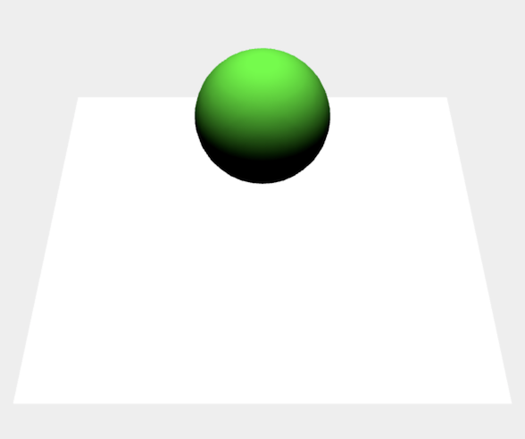

# marching-cubes
マーチングキューブス法の学習
### マーチングキューブス法
任意形状が存在する空間を、一定間隔の格子で区切り、各格子接続点での形状が占める濃度等から境界を作る方法。</br>
詳細は[WiKi](https://github.com/Takahiro-Kunii/marching-cubes/wiki)に書く予定。



# 準備
リポジトリをクローンしcloth.htmlをWebブラウザに読み込ませることで動作確認できる。


このリポジトリでは、以下のリポジトリ
three.js

[https://github.com/mrdoob/three.js.git](https://github.com/mrdoob/three.js.git)

の中から
```
build/three.js
examples/js/controls/TrackballControls.js
```
をjsディレクトリにコピーしている。
